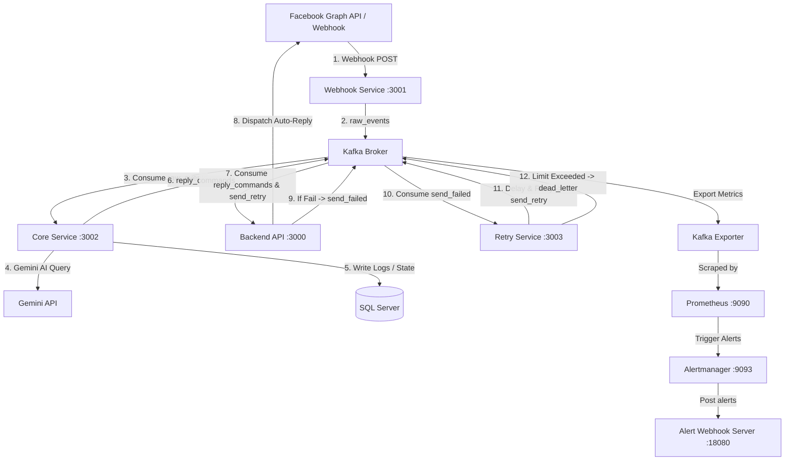

# Facebook Webhook Processing & Moderation System (Kafka Microservices)

Dự án này là hệ thống Microservices xử lý Webhook từ Facebook Page, phân tích nội dung tự động bằng Gemini AI, lọc spam, tự động phản hồi bình luận và quản lý luồng lỗi tin nhắn gửi đi qua Kafka với cơ chế **Exponential Backoff Retry** và **Dead Letter Queue (DLQ)**.

---

## 🏗️ Kiến trúc Hệ thống

Hệ thống được thiết kế theo mô hình Microservice hướng sự kiện (Event-Driven Architecture) giao tiếp hoàn toàn qua Apache Kafka:



### 🗂️ Cấu trúc Solution
*   **[BaiKT4.Contracts](file:///d:/N%C4%83m%203%20-%20K%E1%BB%B3%202/API/BaiKT4/BaiKT4.Contracts)**: Thư viện định nghĩa các Model, Event và Command dùng chung giữa các Service.
*   **[BaiKT4.WebhookService](file:///d:/N%C4%83m%203%20-%20K%E1%BB%B3%202/API/BaiKT4/BaiKT4.WebhookService)**: Nhận webhook từ Facebook, kiểm tra chữ ký HMAC, chuẩn hóa payload thành cấu trúc sự kiện chung và gửi vào Kafka.
*   **[BaiKT4.CoreService](file:///d:/N%C4%83m%203%20-%20K%E1%BB%B3%202/API/BaiKT4/BaiKT4.CoreService)**: Tiêu thụ sự kiện thô, kiểm duyệt spam/blacklist, sử dụng Gemini AI phân tích Ý định (Intent) và Thái độ (Sentiment), quyết định hành động phản hồi.
*   **[BaiKT4.BackendApi](file:///d:/N%C4%83m%203%20-%20K%E1%BB%B3%202/API/BaiKT4/BaiKT4.BackendApi)**: Cung cấp API Dashboard quản lý và tiêu thụ lệnh để gọi Facebook Graph API phản hồi người dùng thực tế (có hỗ trợ cơ chế phòng vệ Idempotency và Circuit Breaker).
*   **[BaiKT4.RetryService](file:///d:/N%C4%83m%203%20-%20K%E1%BB%B3%202/API/BaiKT4/BaiKT4.RetryService)**: Tiêu thụ lệnh lỗi từ Kafka, quản lý thời gian chờ tăng dần (Backoff) và định tuyến tới hàng đợi lỗi (DLQ).
*   **[monitoring/](file:///d:/N%C4%83m%203%20-%20K%E1%BB%B3%202/API/BaiKT4/monitoring)**: Hệ thống giám sát gồm Prometheus, Alertmanager và một HTTP Webhook Server Python dùng để ghi nhận cảnh báo khi có tin nhắn rơi vào DLQ.

---

## 📨 Kafka Topics

| Tên Topic | Nguồn phát (Producer) | Nguồn nhận (Consumer) | Nội dung / Ý nghĩa |
| :--- | :--- | :--- | :--- |
| **`raw_events`** | `WebhookService` | `CoreService` | Sự kiện webhook chuẩn hóa nhận được từ Facebook. |
| **`reply_commands`** | `CoreService` | `BackendApi` | Lệnh gửi bình luận phản hồi hoặc ẩn bình luận của người dùng. |
| **`send_failed`** | `BackendApi` | `RetryService` | Ghi nhận các lệnh phản hồi bị lỗi khi gọi API Facebook. |
| **`send_retry`** | `RetryService` | `BackendApi` | Các lệnh lỗi được lên lịch gửi lại sau khoảng thời gian chờ (delay). |
| **`dead_letter`** | `RetryService` | `Prometheus` (Giám sát) | Hòm thư chết chứa các lệnh thất bại hoàn toàn quá số lần cấu hình (Max: 3). |

---

## 🔄 Luồng Nghiệp Vụ Cốt Lõi

### Luồng 1: Bình luận mới $\rightarrow$ Xử lý phản hồi tự động
1. **Facebook Webhook** gửi dữ liệu POST về đầu endpoint `/webhook` của `WebhookService`.
2. `WebhookService` xác thực chữ ký số, giải mã dữ liệu, chuyển thành `NormalizedWebhookEvent` và đẩy vào topic `raw_events`.
3. `CoreService` tiêu thụ sự kiện từ `raw_events`:
    * Kiểm tra Rate Limit người dùng (Max 20 req/phút).
    * Kiểm tra xem user có nằm trong danh sách đen `BlacklistedUsers` hay không.
    * Kiểm tra nội dung chứa từ cấm hoặc liên kết lừa đảo (`IsSimpleSpam`, `IsMaliciousOrScamContent`).
    * Gọi **Gemini AI API** phân loại ý định (`intent`) và thái độ (`sentiment`).
    * Chạy luật nghiệp vụ quyết định hành động tự động (`auto_reply` / `hide_comment` / `blacklist`).
4. Nếu hành động là `auto_reply`, Core Service đẩy `ReplyCommand` vào topic `reply_commands`.
5. `BackendApi` tiêu thụ `reply_commands`, kiểm tra phòng tránh lặp lệnh (Idempotency Key) bằng SQL Server, sau đó gọi **Facebook Graph API** trả lời thực tế trên trang của người dùng.

### Luồng 2: Thất bại khi gửi $\rightarrow$ Thử lại & Dead Letter Queue
1. `BackendApi` gặp sự cố khi gọi API Facebook (mất mạng, hết token, quá tải...).
2. Exception được bắt lại, hệ thống phân loại lỗi (`IsRetryable`):
    * Lỗi có thể thử lại (Mạng, Timeout, HTTP 429, HTTP 5xx) $\rightarrow$ Đóng gói thành `SendFailedEvent` với cờ `Retryable = true`.
    * Lỗi không thể thử lại (HTTP 401 Unauthorized...) $\rightarrow$ Đóng gói thành `SendFailedEvent` với cờ `Retryable = false`.
3. Đẩy `SendFailedEvent` vào topic `send_failed`.
4. `RetryService` tiêu thụ sự kiện lỗi này:
    * Nếu lỗi không thể thử lại hoặc số lần thử lại đã đạt mức tối đa (Max: 3) $\rightarrow$ Chuyển đổi thành `DeadLetterEvent` và đẩy vào topic **`dead_letter`** (DLQ).
    * Nếu lỗi có thể thử lại và lượt thử <= 3 $\rightarrow$ Chờ độ trễ lũy thừa (ví dụ: $2^{RetryCount}$ giây), tăng số lần thử lại (`RetryCount++`), sau đó đẩy ngược lệnh vào topic **`send_retry`** để `BackendApi` tiêu thụ và gửi lại.

---

## 📈 Giám sát & Cảnh báo (Monitoring)

Dự án cài đặt hệ thống giám sát thời gian thực tự động:
1. **Kafka Exporter** lấy số liệu thông số của Kafka Broker và chuyển đổi sang dạng Prometheus.
2. **Prometheus** thu thập chỉ số đó và chạy luật đánh giá cảnh báo. Cụ thể: Nếu topic `dead_letter` nhận thêm bất kỳ tin nhắn lỗi nào trong vòng 1 phút, Prometheus lập tức kích hoạt cảnh báo `DeadLetterTopicReceivedMessages`.
3. Cảnh báo được chuyển sang **Alertmanager**.
4. **Alertmanager** gửi HTTP POST chứa JSON chi tiết lỗi tới webhook server Python (`alert-webhook`) để in ra log hoặc gửi thông báo.

---

## ⚡ Hướng dẫn cài đặt nhanh

### 1. Chuẩn bị biến môi trường
Tạo file `.env` tại thư mục gốc từ file `.env.example`:
```powershell
Copy-Item .env.example .env
```
Mở file `.env` và điền khóa API Gemini của bạn:
```env
GEMINI_API_KEY=your_gemini_api_key_here
```

### 2. Khởi chạy toàn bộ hệ thống bằng Docker Compose
Chạy lệnh duy nhất để build và khởi tạo toàn bộ database SQL Server, Kafka, và 4 Microservices:
```powershell
docker compose up --build -d
```

### 3. Danh sách các cổng dịch vụ cục bộ
*   **Backend API Dashboard**: `http://localhost:3000`
*   **Webhook Service (FB Endpoint)**: `http://localhost:3001`
*   **Core Service**: `http://localhost:3002`
*   **Retry Service**: `http://localhost:3003`
*   **Kafka UI (Quản lý Kafka)**: `http://localhost:8085`
*   **Prometheus Console**: `http://localhost:9090`
*   **Alertmanager Console**: `http://localhost:9093`
*   **Alert Webhook Logs**: chạy `docker compose logs -f alert-webhook`

---

## 📑 Tài liệu Hướng dẫn bổ sung
*   **[TESTING.md](file:///d:/N%C4%83m%203%20-%20K%E1%BB%B3%202/API/BaiKT4/TESTING.md)**: Chi tiết các bước và lệnh cURL giả lập kịch bản Webhook, Test AI, Test lỗi gửi tin và Retry tự động.
*   **[FACEBOOK_SUBSCRIPTION.md](file:///d:/N%C4%83m%203%20-%20K%E1%BB%B3%202/API/BaiKT4/FACEBOOK_SUBSCRIPTION.md)**: Hướng dẫn đăng ký Webhook và cấu hình ứng dụng trên Cổng nhà phát triển Meta Developer Portal.
